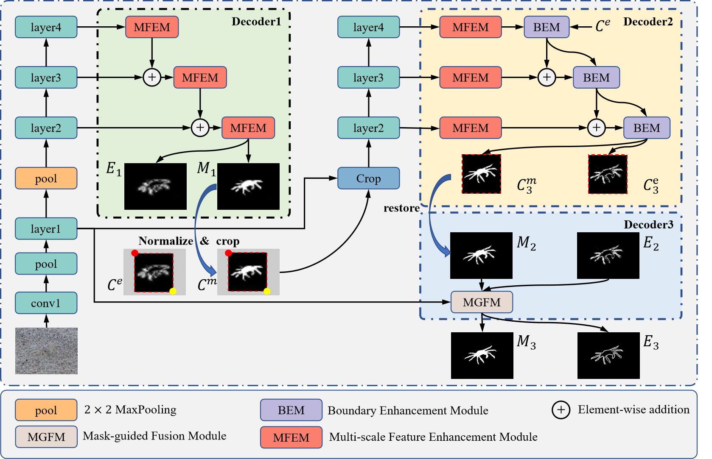
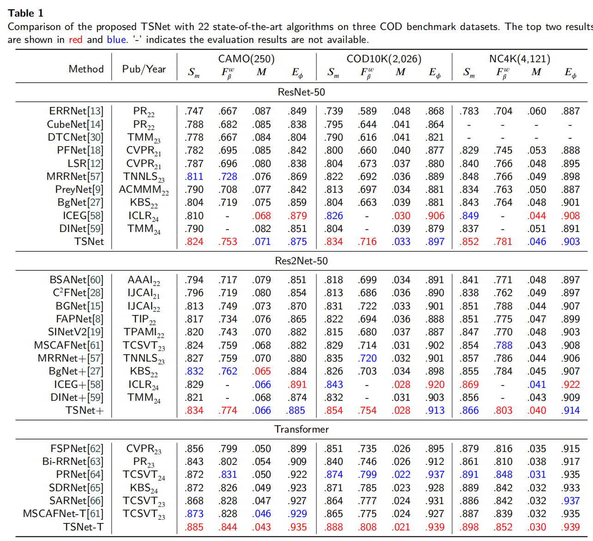
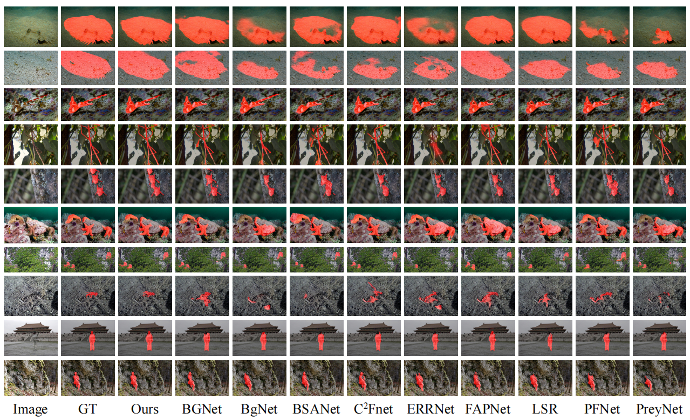

# TSNet
# [A three-stage model for camouflaged object detection](https://doi.org/10.1016/j.neucom.2024.128784)

This repo. is an official implementation of the *TSNet* , which has been accepted in the journal *Neurocomputing, 2024*. 

The main pipeline is shown as the following, 


And some results are presented



## Datasets
Training and testing datasets are available at 

([Baidu](https://pan.baidu.com/s/1sJ8h8srJg0gmVE-kJLJ4og)) [code:q5e4]

([Google](https://drive.google.com/file/d/1VS8qVUjC__4BZhB-13S3wHDWAs_-YFDI/view?usp=sharing))

## Training
```
python train.py
```

## Test
```
 python test.py
```
We provide the trained model file ([Baidu](https://pan.baidu.com/s/1j5pGbXzQ1Jpp_1-FJi6UvA)) [code:r7wc] ([Google](https://drive.google.com/file/d/1ZLhYKFrke1paKryssQJTmcvs9WPEfQGU/view?usp=share_link))

The prediction results are also available ([Baidu](https://pan.baidu.com/s/1WoY4dNgqOL3O4Sa9TXa3VQ)). [code:ijj9]


## Citation
Please cite the `AFNet` in your publications if it helps your research:
```
@article{CHEN2022,
  title = {Adaptive fusion network for RGB-D salient object detection},
  author = {Tianyou Chen and Jin Xiao and Xiaoguang Hu and Guofeng Zhang and Shaojie Wang},
  journal = {Neurocomputing},
  year = {2023},
}
```
## Reference
[BBSNet](https://github.com/zyjwuyan/BBS-Net)
